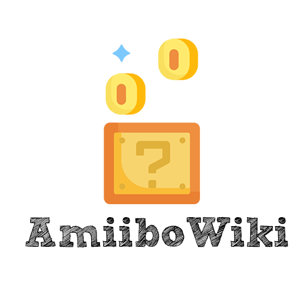

# AmiiboWiki

Application to read and watch the Amiibo data.  It has a feature to read the nfc tag associated with it and watch the detail of the scanned Amiibo.

## Setup

In order to setup the project and be able to run it please follow [Our Setup Guide](./SETUP.md)

## Features

* Amiibo list
* Amiibo filtering
* Amiibo Details
* Amiibo Related Games
* Game Details and Trailer
* Scan Amiibos
* Offline support

### Architecture

* Clean + MVI in presentation layer
* Modules per feature + a common module called **Core**
* We have interfaces for the repositories in order to respect the dependencies rule on the usecases,
as they should not be aware of the repositories impl that will be in an upper layer than usecases
* We do not have interfaces for usecases and some components following YAGNI

## Built With

* [Dagger 2.*](https://github.com/google/dagger)
* [Retrofit](https://github.com/square/retrofit)
* [Airbnb DeepLink dispatcher](https://github.com/airbnb/DeepLinkDispatch)
* [ShimmerLayout] (https://github.com/team-supercharge/ShimmerLayout) it's deprecated but it works also is just an UI detail ...
* [Facebook Shimmer](https://github.com/facebook/shimmer-android)
* [Lottie](https://lottiefiles.com/)
* Espresso
* [Mockk](https://mockk.io/)

## Gradle Tasks 

[Read](./TASKS.md)

## License & Acknowledgments

This project is licensed under the MIT License - see the [LICENSE.md](LICENSE.md) file for details

## Acknowledgments

Coins made by FreePick from www.flaticon.com

Coins made by FreePick from www.flaticon.com

Pawn made by Nikita Golubev from www.flaticon.com

pokeball made by Those Icons from www.flaticon.com

Mushroom made by Those Icons from www.flaticon.com

Psyduck made by Those Icons from www.flaticon.com

Amiibo is a Nintendo trademark and all the rights belongs to them

The font used by the project is https://fonts.google.com/specimen/Rubik

ont used by the project is https://fonts.google.com/specimen/Rubik
